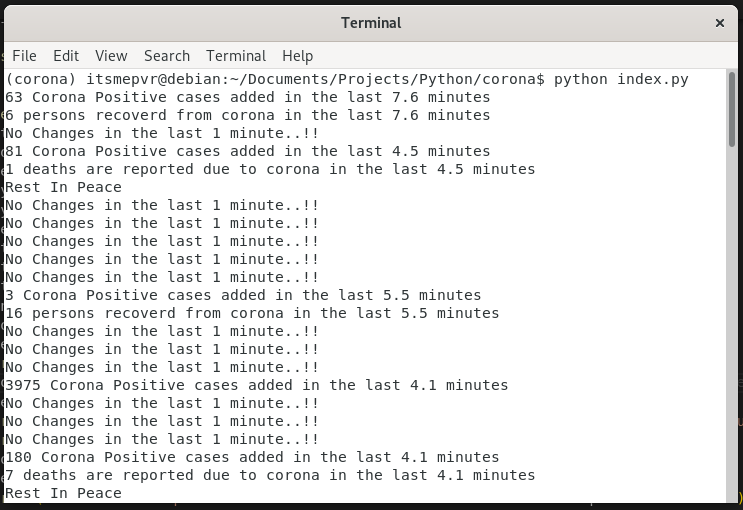

### Real Time Tracking Corona Cases 

# Track corona cases, deaths and recovered around the world.

API URI - https://corona.lmao.ninja/all (https://github.com/NovelCOVID/API)

``` Shoutsout when there is a change in real time data in Corona cases ```



### Install: 
```bash
git clone "https://github.com/itsmepvr/tracking-corona.git"
cd tracking-corona
```
Install pipenv for environment (optional)
```bash
pip install -r requirements.txt
```

### Usage:
```bash
python index.py
```
For every 1 minute the data is updated and for any changes it screams out loud and save the data to data.json file.

## Built With

* Python 3.6
* Pipenv

## licensed

This project is licensed under the MIT License

## Authors

* **Venkata Ramana P** - [itsmepvr](https://itsmepvr.github.io)